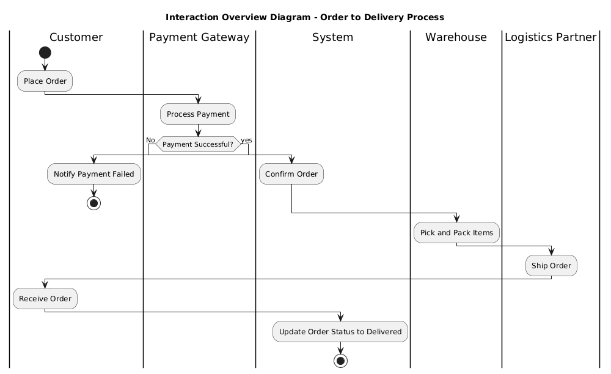
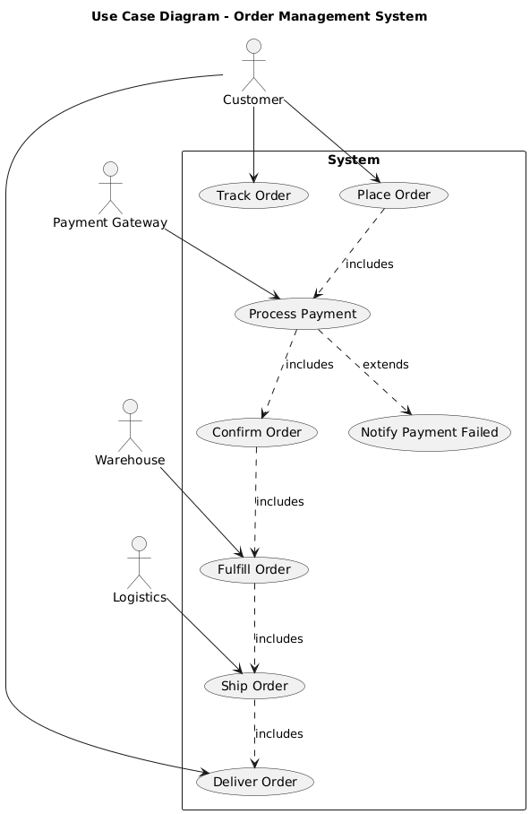
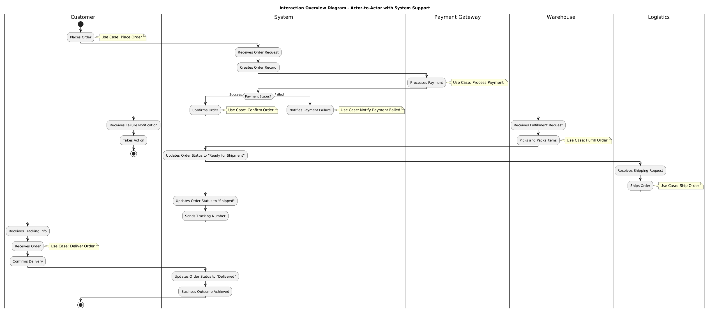

# Practical Report - System Interaction Design

## 1. Practical Work Overview

For this practical, I worked on designing system interaction models using UML diagrams. The task was to create three interconnected diagrams from an actor-to-actor perspective, all working towards achieving one business outcome: **"Order Successfully Delivered to Customer"**.

The three deliverables are:
1. **Interaction Overview Diagram (IoD)** – Actor-to-Actor perspective
2. **Use Case Diagram (UCD)** – System functionality to support interactions
3. **Interaction Overview Diagram (IoD)** – System-supported actor interactions

---

## 2. Diagrams

### 2.1 Interaction Overview Diagram (IoD) – Actor-to-Actor Perspective

**Description:**  

This diagram shows the big picture of how the Customer, Payment Gateway, Warehouse, and Logistics Partner interact to get an order delivered. I kept it simple here, just showing the flow between actors without getting into what the system does behind the scenes. The main flow goes from placing an order all the way to delivery, with a small detour in case the payment fails.

---

### 2.2 Use Case Diagram (UCD) – System Functionality

**Description:** 

For this one, I focused on the system itself. I defined what the system needs to do to make everything work. I came up with 8 main use cases, from "Place Order" to "Deliver Order." I also added "Track Order" because customers usually want to know where their package is. The arrows show how each use case depends on others, for example, you can't confirm an order until payment is processed.

---

### 2.3 Interaction Overview Diagram (IoD) – System-Supported Actor Interactions

**Description:**  

This is where I brought everything together. Instead of actors talking directly to each other, I showed how they communicate **through the system**. The system acts like a middleman, it takes the customer's order, talks to the payment gateway, tells the warehouse what to pack, and notifies logistics to ship it. I also included what happens if payment fails so the diagram covers both success and failure scenarios.

---

## 3. Reflection

This practical really helped me understand how different UML diagrams connect with each other. Before this, I kind of thought each diagram was its own separate thing, but now I see they all work together to tell a complete story.

The hardest part for me was keeping everything consistent across all three diagrams. I had to keep going back to make sure the same actors appeared in each one and that they all led to the same business outcome. There were a couple of times I realized I had missed something, like adding the tracking use case, but going through each diagram step by step helped me catch those mistakes.

If I were to do this again, I would probably add more alternate flows, like what happens if an item is out of stock or if the customer wants to cancel. That would make the design more complete.

---

## 4. Conclusion

This practical walked me through the process of designing system interactions using UML diagrams. I was able to create three diagrams that connect with each other and all lead to the same business outcome. The first IoD gave me the high-level view, the UCD helped me think about what the system actually needs to do, and the final IoD showed how everything fits together with the system as the middleman.

One thing I learned is that good system design isn't just about drawing diagrams, it is about making sure everything is consistent and actually works together to solve a real problem. If I had more time, I'd probably go deeper into the alternate flows and maybe add sequence diagrams to show the detailed interactions step by step.

---
## 5. AI Assistance Reference

https://chat.deepseek.com/share/k098vwrn8bac02thk8

## 6. AI Assisted Diagramming

https://www.planttext.com/