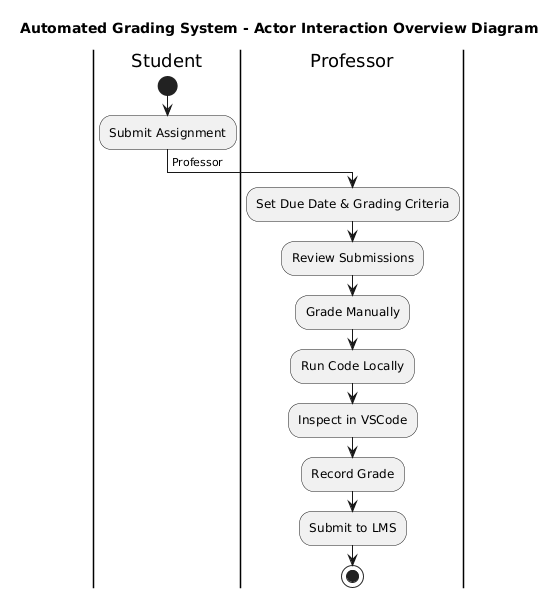
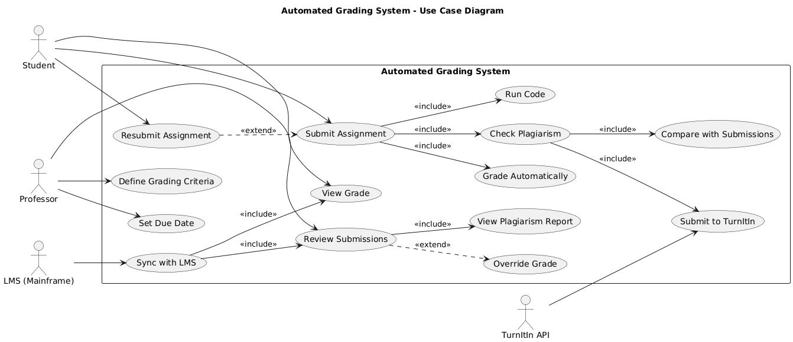
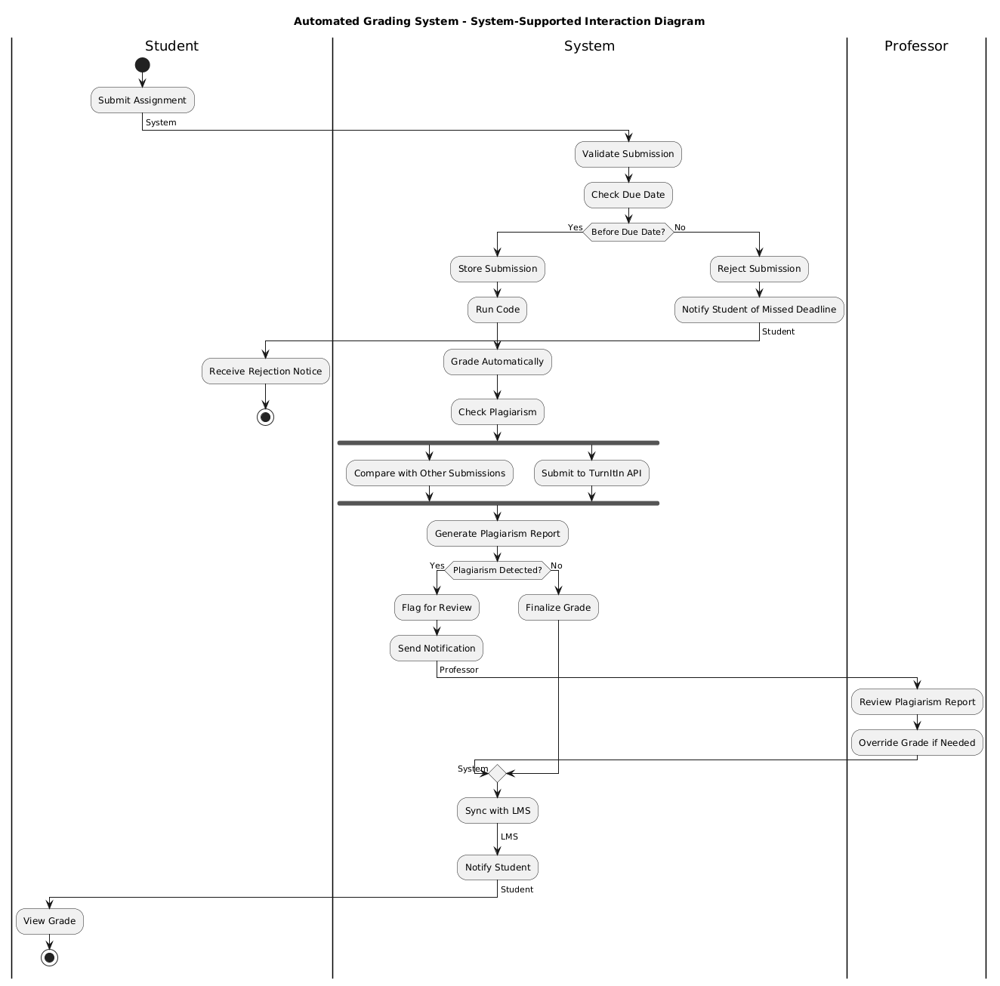

# Practical Report - Automated Grading System Design

## 1. Practical Work Overview

For this practical, I worked on designing system interaction models using UML diagrams for an automated Grading System at a university. The goal was to move away from the current manual process where students submit code to GitHub and professors manually clone, run, and grade each submission. The business outcome I focused on was: **"Assignment Successfully Graded and Recorded in LMS"**.

The three deliverables are:
1. **Interaction Overview Diagram (IoD)** – Actor-to-Actor perspective (current manual process)
2. **Use Case Diagram (UCD)** – System functionality to support automated grading
3. **Interaction Overview Diagram (IoD)** – System-supported actor interactions (new automated process)

---

## 2. Diagrams

### 2.1 Interaction Overview Diagram (IoD) – Actor-to-Actor Perspective

**Description:**

This diagram shows how things currently work before any automation. The student submits their assignment to GitHub, and then the professor has to do everything manually: clone the repository, run the code in terminal, inspect it in VSCode, figure out a grade, and finally enter it into the LMS. Looking at this diagram, I realized how much time this must take, especially with 300+ students each year. There's no system in the middle helping out, it's just direct handoffs between the student and professor. The business outcome still gets achieved eventually.

---

### 2.2 Use Case Diagram (UCD) – System Functionality

**Description:**

For this one, I focused on the system itself. I defined what the system needs to do to make everything work. I came up with 14 use cases, from "Submit Assignment" to "Sync with LMS." I also added "Resubmit Assignment" because students can submit as many attempts as they want to improve their grade. The arrows show how each use case depends on others, for example, can't check plagiarism without running the code first.

The include arrows show the chain of events: when a student submits an assignment, the system automatically runs the code, calculates the grade, and checks for plagiarism all in one go. I also added an extend relationship for resubmissions since that's optional. The professor has extend too for overriding grades in case the automated system flags something unusual.

One thing I had to think carefully about was the LMS integration. Since the university's LMS is mainframe-based and hard to change, I made "Sync with LMS" its own use case that connects to both viewing grades and reviewing submissions. That way the system can just push data to the LMS without needing to modify it.

---

### 2.3 Interaction Overview Diagram (IoD) – System-Supported Actor Interactions

**Description:**

This is where I brought everything together. Instead of professors doing everything manually, I showed how the system acts like a middleman, taking the student's submission, running the code, checking for plagiarism, talking to TurnItIn, and syncing with the LMS. I also included what happens if the submission is late or if plagiarism is detected so the diagram covers both success and failure scenarios.

The student submits their assignment to the system, which first checks if it is before the due date. If it is, the system runs the code, calculates the grade, and checks for plagiarism. I included both internal comparison and TurnItIn as parallel processes because the requirement said plagiarism detection must involve both. If plagiarism is detected, the system flags it and notifies the professor to review. If not, it just finalizes the grade and syncs with the LMS. The student gets notified either way.

---

## 3. Reflection

This practical really helped me understand how different UML diagrams connect with each other. Before this, I kind of thought each diagram was its own separate thing, but now I see they all work together to tell a complete story. The first IoD gave me the high level view of the current manual process, the UCD helped me think about what the system actually needs to do, and the final IoD showed how everything fits together with the system as the middleman.

The hardest part for me was keeping everything consistent across all three diagrams. I had to keep going back to make sure the same actors appeared in each one and that they all led to the same business outcome. There were a couple of times I realized I had missed something, like adding the TurnItIn integration, but going through each diagram step by step helped me catch those mistakes.

Another challenge was dealing with the constraints given in the brief. The university has a mainframe-based LMS that's hard to change, so I had to design the system to sync with it rather than replace it. The limited IT budget also influenced my thinking, using TurnItIn's existing API instead of building a custom plagiarism checker makes sense cost-wise. The university also wants to maintain its reputation for high performing graduates, so the system has to be academically honest, which is why I made sure plagiarism detection was a key part of the design.

If I were to do this again, I would probably add more alternative flows, like what happens if the TurnItIn API is down or if the LMS sync fails. I might also add a separate diagram showing the data flow between components since this system has to talk to both LMS and TurnItIn. That would make the design more complete.

---

## 4. Conclusion

This practical walked me through the process of designing system interactions using UML diagrams. I was able to create three diagrams that connect with each other and all lead to the same business outcome: assignments being graded and recorded in the LMS.

The first IoD showed me how painful the current manual process is, with professors spending hours cloning repositories and running code manually. The UCD helped me think through all the features the system needs, from running code to checking plagiarism to syncing with the LMS. The final IoD showed how everything comes together with the system as the central hub, automating most of the work and leaving professors to focus only on cases that need human judgment.

One thing I learned is that good system design isn't just about drawing diagrams, it's about making sure everything is consistent and actually works together to solve a real problem, and have to understand the existing process, figure out what the system actually needs to do, and then design something that fits within real world constraints like an old LMS and a tight budget.

If I had more time, I did probably go deeper into the alternative flows and maybe add sequence diagrams to show the detailed interactions with the TurnItIn API and LMS step by step. But overall, this exercise gave me a solid framework for approaching system design projects.

---

## 7. AI Assistance Reference

https://chat.deepseek.com/share/h81bhyfz970eftrm6b

## 8. AI Assisted Diagramming

https://www.planttext.com/.

